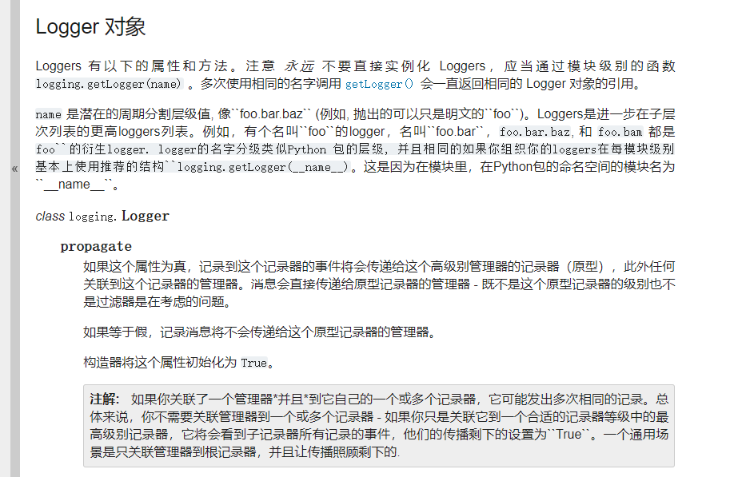
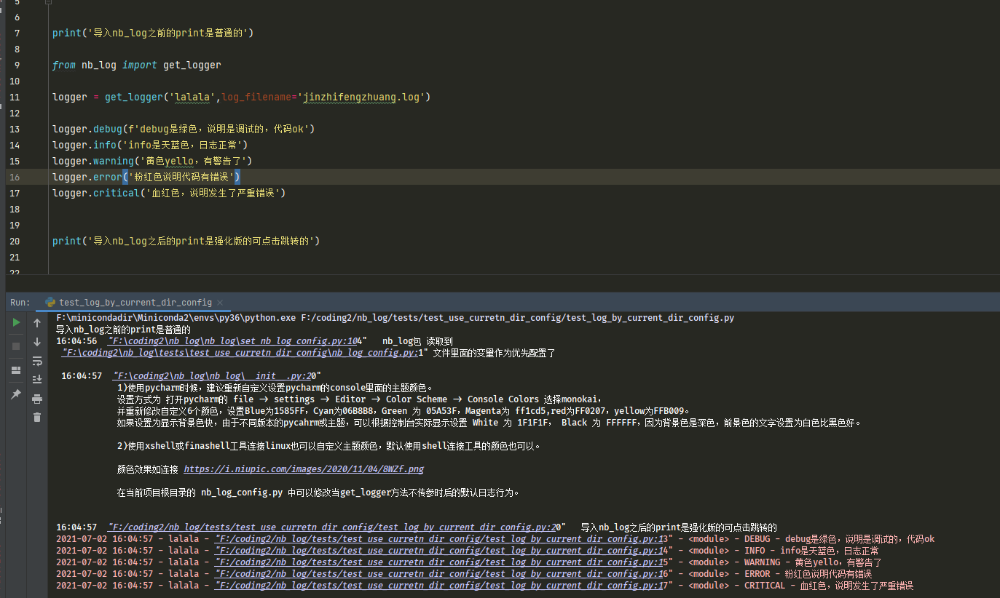

# 1.nb_log 简介

[nb_log readthedocs文档链接](https://nb-log-doc.readthedocs.io/zh_CN/latest)

[nb_log 源码链接](https://github.com/ydf0509/nb_log)

[//]: # ([![image.png]&#40;https://i.postimg.cc/ydqgWDRW/image.png&#41;]&#40;https://postimg.cc/HJ2shsBC&#41;)

[](https://imgse.com/i/pkFSfc8)


文中文档较长，但其中大部分不是 讲解nb_log 的用法，是复习内置logging的概念。
是由于python人员不懂logging包的日志命名空间和python日志树形命名空间结构，不懂handlers和logger的关系是什么。
所以需要很长的篇幅。

很多pythoner到现在都不知道python的 logging.getLogger() 第一个入参的意义和作用，造成nb_log也不知道怎么使用多命名空间。

## tips: 要想更简单简化使用日志,请安装kuai_log

pip install kuai_log

```
kuai_log 是没有基于logging封装,但kuai_log是100%兼容logging包的方法名和入参.
kuai_log的KuaiLogger方法和入参在logging的Logger一定存在且相同, 但是logging包有的小众方法,kuai_log不存在

kuai_log比logging和loguru快30倍,比nb_log快4倍.

kuai_log 不需要配置文件,全部用入参

kuai_log 没有依赖任何三方包,nb_log依赖某些三方包

```

## nb_log  logging loguru 快速比较

| 维度     | loguru  | logging | nb\_log           |
| ------ | ------- | ------- | ----------------- |
| 易用性    | ✅ 简单    | ❌ 繁琐    | ✅ 简单              |
| 命名空间   | ❌ 无     | ✅ 完善    | ✅ 完善              |
| 第三方库兼容 | ❌ 容易污染  | ✅ 安全    | ✅ 安全              |
| 美化输出   | ✅ 默认很好看 | ❌ 需配置   | ✅ 默认美观            |
| 拓展性    | ⚠️ 不够灵活 | ✅ 高     | ✅ 更高（支持多 handler） |
| 上手体验   | ✅ 快速爽   | ❌ 枯燥复杂  | ✅ 一秒用上好日志         |


## 1.0 nb_log 安装

pip install nb_log

## 1.0.1 nb_log不仅是日志，还对print以及sys.stdout(sys.stderr) 打了强力的猴子补丁

对代码里面的print打了猴子补丁，自动显示print所在地方的文件名和精确行号，不怕有人胡乱print，找不到在哪里print的了。

对代码里面的 print 以及 streamHanlder日志调用的sys.stdout/stderr 打了猴子补丁，能支持所有标准输出自动写入到文件中,每天生成一个文件。
(见1.1.d配置文件说明的 SYS_STD_FILE_NAME 和 PRINT_WRTIE_FILE_NAME)。


## 1.0.2 nb_log 新增支持loguru包模式来记录日志，原汁原味的loguru来打印控制台和写入日志文件，见文档1.10.b

有了这，还有什么理由还说nb_log不如loguru，loguru只是nb_log的一个子集。

loguru控制台打印模式截图:
[](https://imgse.com/i/pkFShjS)

## 1.1 nb_log 简单使用例子

控制台打印日志：

```python
print('导入nb_log之前的print是普通的')

from nb_log import get_logger

logger = get_logger('lalala',)   # get_logger 只有一个name是必传递的，其他的参数不是必传。
# logger = get_logger('lalala',log_filename='lalala.log',formatter_template=5,log_file_handler_type=2) # get_logger有很多其他入参可以自由定制logger。


logger.debug(f'debug是绿色，说明是调试的，代码ok ')
logger.info('info是天蓝色，日志正常 ')
logger.warning('黄色yello，有警告了 ')
logger.error('粉红色说明代码有错误 ')
logger.critical('血红色，说明发生了严重错误 ')

print('导入nb_log之后的print是强化版的可点击跳转的')
```
### 1.1.a nb_log 写入日志文件

nb_log默认是只打印到控制台，不会把日志写入到文件、kafka、mongo、es、发邮件和钉钉的，nb_log 记录到每一种地方都有单独的控制参数。

只有get_logger 设置了log_filename，那么该logger才会写到这个文件，日志文件夹的路径是 nb_log_config.py 的 LOG_PATH 配置的。

```python
from nb_log import get_logger
logger = get_logger('logger_namespace',
                    log_filename='namespace_file.log',
                    error_log_filename='f4b_error.log')
logger.debug('这条日志会写到文件中')
```

### 1.1.a2 nb_log 写入日志文件,并将错误日志同时写到另外的错误日志文件中

get_logger 传参了 error_log_filename 后，error级别以上的日志会单独写入到错误文件中。
或者 在nb_log_config.py 配置文件中 配置 AUTO_WRITE_ERROR_LEVEL_TO_SEPARATE_FILE = True # 自动把错误error级别以上日志写到单独的文件，根据log_filename名字自动生成错误文件日志名字。

```python
from nb_log import get_logger
logger = get_logger('logger_namespace',
                    log_filename='namespace_file.log',
                    error_log_filename='namespace_file_error.log')
logger.debug('这条日志会写到普通文件中')
logger.error('这条日志会写到普通文件中，同时会单独写入到错误文件中')
```

### 1.1.b nb_log 的最核心函数 get_logger入参说明

```doctest
   :param name 日志命名空间，这个是最重要最难理解的一个入参，很多pythoner到现在还不知道name是什么作用。日志命名空间，意义非常非常非常重要，有些人到现在还不知道 logging.getLogger() 第一个入参的作用，太low了。不同的name的logger可以表现出不同的行为。
                例如让 aa命名空间的日志打印控制台并且写入到文件，并且只记录info级别以上，让 bb 命名空间的日志仅仅打印控制台，并且打印debug以上级别，
                这种就可以通过不同的日志命名空间做到。
        :param log_level_int: 日志输出级别，设置为 1 2 3 4 5，分别对应原生logging.DEBUG(10)，logging.INFO(20)，logging.WARNING(30)，logging.ERROR(40),logging.CRITICAL(50)级别，现在可以直接用10 20 30 40 50了，兼容了。
       :param is_add_stream_handler: 是否打印日志到控制台
       :param is_use_loguru_stream_handler  是否使用 loguru的控制台打印，如果为None，使用 nb_log_config.py的DEFAULUT_IS_USE_LOGURU_STREAM_HANDLER 值。
       :param do_not_use_color_handler :是否禁止使用color彩色日志
       :param log_path: 设置存放日志的文件夹路径,如果不设置，则取nb_log_config.LOG_PATH，如果配置中也没指定则自动在代码所在磁盘的根目录创建/pythonlogs文件夹，
              非windwos下要注意账号权限问题(如果python没权限在根目录建/pythonlogs，则需要手动先创建好)
       :param log_filename: 日志文件名字，仅当log_path和log_filename都不为None时候才写入到日志文件。
       :param error_log_filename :错误日志文件名字，如果文件名不为None，那么error级别以上日志自动写入到这个错误文件。
       :param log_file_size :日志大小，单位M，默认100M
       :param log_file_handler_type :这个值可以设置为1 2 3 4 5 6 7，1为使用多进程安全按日志文件大小切割的文件日志
              2为多进程安全按天自动切割的文件日志，同一个文件，每天生成一个日志
              3为不自动切割的单个文件的日志(不切割文件就不会出现所谓进程安不安全的问题)
              4为 WatchedFileHandler，这个是需要在linux下才能使用，需要借助lograte外力进行日志文件的切割，多进程安全。
              5 为第三方的concurrent_log_handler.ConcurrentRotatingFileHandler按日志文件大小切割的文件日志，
                这个是采用了文件锁，多进程安全切割，文件锁在linux上使用fcntl性能还行，win上使用win32con性能非常惨。按大小切割建议不要选第5个个filehandler而是选择第1个。
              6 为作者发明的高性能多进程安全，同时按大小和时间切割的文件日志handler
              7 为 loguru的 文件日志记录器
       :param mongo_url : mongodb的连接，为None时候不添加mongohandler
       :param is_add_elastic_handler: 是否记录到es中。
       :param is_add_kafka_handler: 日志是否发布到kafka。
       :param ding_talk_token:钉钉机器人token
       :param ding_talk_time_interval : 时间间隔，少于这个时间不发送钉钉消息
       :param mail_handler_config : 邮件配置
       :param is_add_mail_handler :是否发邮件
       :param formatter_template :日志模板，如果为数字，则为nb_log_config.py字典formatter_dict的键对应的模板，
                                1为formatter_dict的详细模板，2为简要模板,5为最好模板。
                                如果为logging.Formatter对象，则直接使用用户传入的模板。
       :type log_level_int :int
       :type is_add_stream_handler :bool
       :type log_path :str
       :type log_filename :str
       :type mongo_url :str
       :type log_file_size :int
 
   
```

log_filename 用于设置是否写入日志文件和写入什么文件中。有的人不看入参文档，就问nb_log为什么不写入日志文件中。
logger和handler是观察者模式，日志记录到哪些地方，是由添加了什么handlers决定的。

### 1.1.c nb_log配置文件的生成和导入。

项目中任意脚本使用nb_log,第一次运行代码时候，会自动在 sys.path[1] 目录下创建 nb_log_config.py文件并写入默认值。
之后nb_log 会自动 import nb_log_config, 如果import到这个模块了，控制台会提示读取了什么文件作为配置文件。

如果是 cmd或者linux运行不是pycharm，需要 设置 PYTHONPATH为项目根目录，这样就能自动在当前项目根目录下生成或者找到 nb_log_config.py了。

用户可以print(sys.path)  print(sys.path[1]) 来查看 sys.path[1]的值是什么就知道了。

连PYTHONPATH作用是什么都不知道的python小白，一定要看下面文章 。

[pythonpath作用介绍的文章](https://github.com/ydf0509/pythonpathdemo)


### 1.1.d nb_log配置文件的一些参数说明。

```doctest

# 项目中的print是否自动写入到文件中。值为None则不重定向print到文件中。 自动每天一个文件， 2023-06-30.my_proj.print,生成的文件位置在定义的LOG_PATH
# 如果你设置了环境变量，export PRINT_WRTIE_FILE_NAME="my_proj.print" (linux临时环境变量语法，windows语法自己百度这里不举例),那就优先使用环境变量中设置的文件名字，而不是nb_log_config.py中设置的名字
PRINT_WRTIE_FILE_NAME = Path(sys.path[1]).name + '.print' 

# 项目中的所有标准输出（不仅包括print，还包括了streamHandler日志）都写入到这个文件。自动每天一个文件， 2023-06-30.my_proj.std,生成的文件位置在定义的LOG_PATH
# 如果你设置了环境变量，export SYS_STD_FILE_NAME="my_proj.std"  (linux临时环境变量语法，windows语法自己百度这里不举例),那就优先使用环境变量中设置的文件名字，，而不是nb_log_config.py中设置的名字
SYS_STD_FILE_NAME = Path(sys.path[1]).name + '.std'   

USE_BULK_STDOUT_ON_WINDOWS = False # 在win上是否每隔0.1秒批量stdout,win的io太差了

DEFAULUT_USE_COLOR_HANDLER = True  # 是否默认使用有彩的日志。
DEFAULUT_IS_USE_LOGURU_STREAM_HANDLER = False # 是否默认使用 loguru的控制台日志，而非是nb_log的ColorHandler
DISPLAY_BACKGROUD_COLOR_IN_CONSOLE = True  # 在控制台是否显示彩色块状的日志。为False则不使用大块的背景颜色。
AUTO_PATCH_PRINT = True  # 是否自动打print的猴子补丁，如果打了猴子补丁，print自动变色和可点击跳转。

SHOW_PYCHARM_COLOR_SETINGS = True  # 有的人很反感启动代码时候提示教你怎么优化pycahrm控制台颜色，可以把这里设置为False
SHOW_NB_LOG_LOGO = True  # 有的人方案启动代码时候打印nb_log 的logo图形,可以设置为False

DEFAULT_ADD_MULTIPROCESSING_SAFE_ROATING_FILE_HANDLER = False  # 是否默认同时将日志记录到记log文件记事本中，就是用户不指定 log_filename的值，会自动写入日志命名空间.log文件中。
AUTO_WRITE_ERROR_LEVEL_TO_SEPARATE_FILE = False # 自动把错误error级别以上日志写到单独的文件，根据log_filename名字自动生成错误文件日志名字。
LOG_FILE_SIZE = 1000  # 单位是M,每个文件的切片大小，超过多少后就自动切割
LOG_FILE_BACKUP_COUNT = 10  # 对同一个日志文件，默认最多备份几个文件，超过就删除了。

LOG_PATH = '/pythonlogs'  # 默认的日志文件夹,如果不写明磁盘名，则是项目代码所在磁盘的根目录下的/pythonlogs
# LOG_PATH = Path(__file__).absolute().parent / Path("pythonlogs")   #这么配置就会自动在你项目的根目录下创建pythonlogs文件夹了并写入。
if os.name == 'posix':  # linux非root用户和mac用户无法操作 /pythonlogs 文件夹，没有权限，默认修改为   home/[username]  下面了。例如你的linux用户名是  xiaomin，那么默认会创建并在 /home/xiaomin/pythonlogs文件夹下写入日志文件。
    home_path = os.environ.get("HOME", '/')  # 这个是获取linux系统的当前用户的主目录，不需要亲自设置
    LOG_PATH = Path(home_path) / Path('pythonlogs')  # linux mac 权限很严格，非root权限不能在/pythonlogs写入，修改一下默认值。

LOG_FILE_HANDLER_TYPE = 1  # 1 2 3 4 5
"""
LOG_FILE_HANDLER_TYPE 这个值可以设置为 1 2 3 4 5 四种值，
1为使用多进程安全按日志文件大小切割的文件日志,这是本人实现的批量写入日志，减少操作文件锁次数，测试10进程快速写入文件，win上性能比第5种提高了100倍，linux提升5倍
2为多进程安全按天自动切割的文件日志，同一个文件，每天生成一个新的日志文件。日志文件名字后缀自动加上日期。
3为不自动切割的单个文件的日志(不切割文件就不会出现所谓进程安不安全的问题) 
4为 WatchedFileHandler，这个是需要在linux下才能使用，需要借助lograte外力进行日志文件的切割，多进程安全。
5 为第三方的concurrent_log_handler.ConcurrentRotatingFileHandler按日志文件大小切割的文件日志，
   这个是采用了文件锁，多进程安全切割，文件锁在linux上使用fcntl性能还行，win上使用win32con性能非常惨。按大小切割建议不要选第5个个filehandler而是选择第1个。
"""

FILTER_WORDS_PRINT = []  # 例如， 你希望消息中包括阿弥陀佛 或者 包括善哉善哉 就不打印，那么可以设置  FILTER_WORDS_PRINT = ['阿弥陀佛','善哉善哉']
```

以上只是部分配置的例子，其他配置在你项目根目录下的 nb_log_config.py中都有默认值，自己按需修改设置。
其他例如日志模板定义，默认日志模板选择什么，都可以在 nb_log_config.py文件中设置。


### 1.1.1e  日志配置文件和get_logger传参的关系。


nb_log_config.py中是设置全局设置，get_logger是针对单个logger对象生成的设置。

例如 nb_log_config.py 中写 FORMATTER_KIND = 4，get_logger 传参 formatter_template=6，那么最终还是使用第6个日志模板。
如果get_logger函数没有传参指定就使用 nb_log_config.py中的配置。
就是说 get_logger 是优先级高的，nb_log_config.py 是优先级低的配置方式。


## 1.2 nb_log功能介绍

### 1.2.1 nb_log 支持日志根据级别自动变彩色

如图：日志彩色符合交通灯颜色认知。绿色是debug等级的日志，天蓝色是info等级日志，
黄色是warnning等级的警告日志，粉红色是error等级的错误日志，血红色是criticl等级的严重错误日志

### 1.2.1b 设置是否需要彩色
nb_log支持自动彩色，也支持关闭背景色块只要颜色，也支持彻底不要颜色所有日志显示为正常黑白颜色。

可以在你项目根目录下自动生成的nb_log_config.py配置文件中修改相关配置，来控制是否需要颜色，或者要颜色但不要大块的背景色块。

```angular2html
如果反对日志有各种彩色，可以设置 DEFAULUT_USE_COLOR_HANDLER = False
如果反对日志有块状背景彩色，可以设置 DISPLAY_BACKGROUD_COLOR_IN_CONSOLE = False
如果想屏蔽nb_log包对怎么设置pycahrm的颜色的提示，可以设置 WARNING_PYCHARM_COLOR_SETINGS = False
如果想改变日志模板，可以设置 FORMATTER_KIND 参数，只带了7种模板，可以自定义添加喜欢的模板
LOG_PATH 配置文件日志的保存路径的文件夹。
```

### 1.2.1c 关于彩色显示效果的最终显示的说明

有的人听说了python显示颜色的博客，例如这种

[python print显示颜色](https://www.cnblogs.com/ping-y/p/5897018.html)

```
python在控制台可以同时显示7种颜色，但是同时显示不出来65536种颜色，pycahrm控制台/win cmd/linux的控制台终端不是浏览器网页，不能显示丰富的65536色模式，
只能暴露7种ansi颜色钩子，显示控制台输出的终端软件一般提供了颜色的自定义设置，例如 pycahrm finashell xhsell
这些软件都可以对ansi颜色自定义65536色模式的颜色代码，
例如nb_log启动时候就打印提示了教用户怎么设置颜色。

例如一件拍摄街道的彩色相片有60多种颜色，在cmd pycahrm终端是不可能同时显示出那么多种颜色的。
例如你想要控制台显示杨幂穿的淡红色衣服的颜色，控制台能做得到吗？当然是能做到得，但不是在python种 用所谓得  \033[ 来设置颜色，
因为软件终端只能识别7种ansi颜色钩子，红色在65536色模式下最起码也有几万种颜色代码，有白浅红色 水红色 大红色 粉红色 红的发紫的红色 红得发黑的红色，
所以你想精确得让控制台显示多种不同的红色，你自己用大脑想想呗，仅仅在python print中 \033就想得到理想的所需的红色，简直是做梦吧。
我说的是要精确控制颜色，不能光靠python的\033[，而是要在python的终端输出软件中设置颜色。例如pycharm xhsell finashell软件中都支持自定义颜色。

所以有些小白用户觉得颜色不好看，让我在配置文件中放开自定义颜色，这是不可行的，颜色最终的显示效果由控制台终端决定，不是所谓的\033能决定的，
例如我就想问  \033后面加什么字母能精确得到桃红色 金黄色 亮绿色这些 ，这么简单的想不到吗？如果控制台自动支持65536种颜色同时显示，那么nb_log可以暴露出来怎么配置颜色。
例如  \033[32  是绿色，但是软件终端中重定义ansi 颜色，可以让你代码的\033[32 显示出1万种不同的绿色，当然也可以让\033[32 绿色但是显示成黄色 紫色啥的，
因为最终渲染颜色效果是由终端决定，不是代码中\033后面数字来决定的。用户需要在软件终端中重新定义颜色，拿pycahrm为例，设置各种想要的颜色30秒钟，配置颜色要不了很久。

```

### 1.2.1d pycharm中精确设置控制台颜色的方式
```
要说明的是，即使是同一个颜色代码在pycahrm不同主题都是颜色显示区别很大的，默认的可能很丑或者由于颜色不好导致文字看不清晰
为了达到我这种色彩效果需要重新设置主题颜色，在控制台输出的第一行就教大家怎么设置颜色了。
也可以按下面设置，需要花30秒设置。


1)使用pycharm时候，建议重新自定义设置pycharm的console里面的主题颜色。
设置方式为 打开pycharm的 file -> settings -> Editor -> Color Scheme -> Console Colors 选择monokai，
并重新修改自定义7个颜色，设置Blue为 0454F3 ，Cyan为 04DCF8 ，Green 为 13FC02 ，Magenta为 ff1cd5 ,red为 F80606 ，yellow为 EAFA04 ，gray 为 FFFFFF ，white 为 FFFFFF 。
如果设置为显示背景色快，由于不同版本的pycahrm或主题，可以根据控制台实际显示设置 White 为 1F1F1F， Black 为 FFFFFF，因为背景色是深色，前景色的文字设置为白色比黑色好。

2)使用xshell或finashell工具连接linux也可以自定义主题颜色，默认使用shell连接工具的颜色也可以。

```

### 1.2.2 nb_log 不仅支持日志变彩色，还支持项目中所有python文件的任意print自动变彩色

```
导入nb_log时候会给内置的 ptint 打猴子补丁，所以用户所有地方的print行为自动发生了变化，重定向到nb_log定义的print了
```

### 1.2.2b print自动化效果转换的好处说明
```
自动转换print效果，再也不怕有人在项目中随意print，导致很难找到是从哪里冒出来的print。
只要import nb_log，项目所有地方的print自动现型并在控制台可点击几精确跳转到print的地方。

在项目里面的几百个文件中疯狂print真的让人很生气，一个run.py运行起来几百个py文件，
每个文件print 七八次，到底自己想看想关心的print是在控制台的哪一行呢，找到老眼昏花都找不到。
比如打印x变量的值，有人是为了省代码直接 print(x)，而没有多打几个字母使用print("x的值是：",x)，
这样打印出来的x变量，根本无法通过全局查找找到打印x变量是在什么py文件的哪一行。

有人说把之前的print全部用#注释不就好了，那这要全局找找print，一个一个的修改，一个10万行项目， 
就算平均100行有一个print关键字，那起码也得有1000个print关键字吧，一个个的修改那要改到猴年马月呢。

只有使用nb_log，才能让一切print妖魔鬼怪自动现形。

另外，在正式项目或工具类甚至做得包里面，疯狂print真的很low，可以参考大神的三方包，从来都没直接print的不存在的，
他们都是用的日志。
日志比print灵活多了，对命名空间的控制、级别过滤控制、模板自定义、能记录到的地方扩展性很强远强过print的只有控制台。
```

### 1.2.2c nb_log 五彩日志的效果截图


[](https://imgse.com/i/pkFSO3V)


## 1.3 nb_log 支持pycharm控制台点击日志精确跳转到打印日志的文件和行号

[](https://postimg.cc/w3WRBF5d)

## 1.4 nb_log是原生logging类型，兼容性 扩展性非常好。

nb_log 是基于python自带的原生logging模块封装的， nb_log.get_logger()生成的日志类型是 原生logging.Logger类型，
所以nb_log包对常用三方包日志兼容性替换芯做到了100%。是否是原生日志非常重要，logbook和loguru都不是python自带的原生日志，
所以和三方包结合或者替换性不好。

```
比如logru和logbook这种三方库，完全重新写的日志，
它里面主要被用户使用的logger变量类型不是python内置Logger类型，
造成logger说拥有的属性和方法有的不存在或者不一致，这样的日志和python内置的经典日志兼容性差，
只能兼容（一键替换logger类型）一些简单的debug info warning errror等方法，。
```

## 1.5 nb_log 能够简单讲日志记录到十几种地方的任意几种的组合。


内置了一键入参，每个参数是独立开关，可以把日志同时记录到10几个常用的地方的任意几种组合，
包括 控制台 文件 钉钉 邮件 mongo kafka es 等等 。

有的人以为日志只能记录到控制台和文件，其实是错的，日志可以记录到很多种地方，日志记录到哪里，是由logger添加了什么handler决定的。


## 1.6 日志命名空间独立，采用了多实例logger，按日志命名空间区分。

```python
"""
命名空间独立意味着每个logger单独的日志界别过滤，单独的控制要记录到哪些地方。
"""

from nb_log import get_logger, LogManager

logger_aa = LogManager('aa').get_logger_and_add_handlers(10, log_filename='aa.log')
logger_bb = get_logger("bb", log_level_int=30, is_add_stream_handler=False, ding_talk_token='your_dingding_token')
logger_cc = get_logger('cc', log_level_int=10, log_filename='cc.log')

logger_aa.debug('哈哈哈')
# 将会同时记录到控制台和文件aa.log中，只要debug及debug以上级别都会记录。

logger_bb.warning('嘿嘿嘿')
# 将只会发送到钉钉群消息，并且logger_bb的info debug级别日志不会被记录，非常方便测试调试然后稳定了调高界别到生产。

logger_cc.debug('嘻嘻')
# logger_cc的日志会写在cc.log中，和logger_aa的日志是不同的文件。
```

python命名空间非常重要,有的人太笨了,说设置了级别为logging.WARN,但是debug还是被记录,就是因为他牛头不对马嘴,忽视了是对什么命名空间设置的日志级别,debug日志又是什么命名空间的日志打印出来的

搜索一下文档的"命名空间"4个字,文档里面谈了几百次这个概念了,有的人logging基础太差了,令人吐血,需要在nb_log文档来讲,这样导致nb_log文档很长.


## 1.7 对内置looging包打了猴子补丁，使日志永远不会使用同种handler重复记录 ，例如，原生的

```
from logging import getLogger,StreamHandler
logger = getLogger('hi')
getLogger('hi').addHandler(StreamHandler())
getLogger('hi').addHandler(StreamHandler())
getLogger('hi').addHandler(StreamHandler())
logger.warning('啦啦啦')

明明只warning了一次，但实际会造成 啦啦啦 在控制台打印3次。
使用nb_log，对同一命名空间的日志，可以无惧反复添加同类型handler，不会重复记录。

关于重复记录的例子，更惨的例子在文档后面的例子，直接把机器cpu性能耗尽，磁盘弄爆炸。
```

## 1.8 nb_log使用对比原生logging和 loguru 更简单

### 1.8.1 logging 代码方式创建logger对象

```python
import logging
logger = logging.getLogger('my.logger.namespace')

fh = logging.FileHandler('test.log')  # 可以向文件发送日志

ch = logging.StreamHandler()  # 可以向屏幕发送日志

fm = logging.Formatter('%(asctime)s %(message)s')  # 打印格式

fh.setFormatter(fm)
ch.setFormatter(fm)

logger.addHandler(fh)
logger.addHandler(ch)
logger.setLevel(logging.DEBUG)  # 设置级别


logger.debug('debug 喜喜')

```

有些人简直是怕了原生logging了，为了创建一个好用的logger对象，代码步骤复杂的吓人，很多人完全没看懂这段代码意义，
因为他是一步步创建观察者handler，给handler设置好看的formattor，给给被观察者添加多个观察者对象。
大部分人不看设计模式，不仅不懂观察者模式，而且没听说观察者模式，所以这种创建logger方式完全蒙蔽的节奏。
其实这样一步步的写代码是为了给用户最大的自由来怎么创建一个所需的logger对象。如果高度封装创建logger过程那是简单了，
但是自定义自由度就下降了。
logging是原生日志，每个三方包肯定使用logging了，为了兼容性和看懂三方包，那肯定是要学习logging的，对logging望而却步，
想投机取巧只使用loguru是行不通的，三方包不会使用loguru，三方包里面各种命名空间的日志，等待用户添加handlers来记录日志，
loguru缺点太大了。

nb_log把logging创建logger封装了，但同时get_logger暴露了很多个入参，来让用户自由自定义logger添加什么handler和设置什么formattor。
所以nb_log有原生logging的普遍兼容性，又使用简单


### 1.8.2 python中 创建logger的第二种方式，logging.config.dictConfig()

```python
import logging
import logging.config
 
LOGGING_CONFIG = {
    "version": 1,
    "formatters": {
        "default": {
            'format':'%(asctime)s %(filename)s %(lineno)s %(levelname)s %(message)s',
        },
        "plain": {
            "format": "%(message)s",
        },
    },
    "handlers": {
        "console": {
            "class": "logging.StreamHandler",
            "level": "INFO",
            "formatter": "default",
        },
        "console_plain": {
            "class": "logging.StreamHandler",
            "level":logging.INFO,
            "formatter": "plain"
        },
        "file":{
            "class": "logging.FileHandler",
            "level":20,
            "filename": "./log.txt",
            "formatter": "default",
        }
    },
    "loggers": {
        "console_logger": {
            "handlers": ["console"],
            "level": "INFO",
            "propagate": False,
        },
        "console_plain_file_logger": {
            "handlers": ["console_plain","file"],
            "level": "DEBUG",
            "propagate": False,
        },
        "file_logger":{
            "handlers": ["file"],
            "level": "INFO",
            "propagate": False,
        }
    },
    "disable_existing_loggers": True,
}
 
# 运行测试
logging.config.dictConfig(LOGGING_CONFIG)
logger = logging.getLogger("console_logger")
logger.debug('debug message')
logger.info('info message')
logger.warn('warning message')
logger.error('error message')
logger.critical('critical message')


```

这种方式和上面1.8.1的方式差不多, 但不需要写大量python代码来创建logger对象。
虽然不需要写大量python代码来构建logger对象，但是需要写 LOGGING_CONFIG 字典，
这种字典如果写错了导致配置不生效或者报错，还是很麻烦的。很多人对这个配置完全蒙蔽，不知道什么意思。

先创建formattor，创建文件和控制台handler(当然也可以自定义发送钉钉的handler)，handler设置日志过滤级别，handler设置formattor，
不同的handler可以设置不同的formattor，例如同样是 logger.debug("hello world"),可以使文件和控制台记录的这条日志的前缀和字段不一样。

对不同命名空间的logger添加不同的handlers，
例如你只想打印控制台 就 logger = logging.getLogger("console_logger")，然后用这个logger.info(xxx)就可以打印控制台了。
例如你只想打写入文件 就 logger = logging.getLogger("file_logger")，然后用这个logger.info(xxx)就可以打印控制台了。
例如你打写入文件并且打印控制台 就 logger = logging.getLogger("console_plain_file_logger")，然后用这个logger.info(xxx)就可以打印控制台并且同时写入文件了。


对1.8.1和1.8.2不理解造成恐惧，是使大家使用loguru的主要原因。


### 1.8.3 loguru的简单使用

```python
from loguru import logger
logger.add("./log_files/loguru-test1.log",  rotation="100000 KB")
logger.info("hello")
```

```
代码是loguru打印控制台和写入文件，和nb_log一样代码少。
甚至如果用户不需要写入文件只需要导入logger就好了，

from loguru import logger
logger.info("hello")

看起来很简单，nb_log还需要 get_logger一下，有的人觉得loguru少写一行代码，直接import就能使用了，所以loguru简单牛逼。
nb_log早就知道有人会这么想了，nb_log也支持导入即可使用。

from nb_log import defaul_logger
defaul_logger.info("hello")

但这样有个弊端，用户想使用什么日志模板，用户希望日志记录到 控制台 文件 钉钉 es中的哪几个地方没法定义。
用户如果想屏蔽a函数里面的日志，但想放开b函数里面的日志，这种不传参/不设置日志命名空间的日志就无能为力做到了。
所以nb_log推荐用户调用get_logger函数来自定义日志，而不是直接import defaul_logger然后所有地方都使用这个 defaul_logger来记录日志。
```

### 1.8.4 nb_log的使用可以比loguru更简单

loguru:
```
from loguru import logger
logger.add("./log_files/loguru-test1.log",  rotation="100000 KB")
logger.info("hello")
```

nb_log ,你想简单不想get_loger,你想粗暴的导入就能记录日志到控制台和文件，代码如下：
```
import nb_log

nb_log.debug('笨瓜不想实例化多个不同name的logger,不理解logging.getLogger第一个入参name的作用和好处，想直接粗暴的调用debug函数，那就满足这种人')
nb_log.info('笨瓜不想实例化多个不同name的logger,不理解logging.getLogger第一个入参name的作用和好处，想直接粗暴的调用info函数，那就满足这种人')
nb_log.warning('笨瓜不想实例化多个不同name的logger,不理解logging.getLogger第一个入参name的作用和好处，想直接粗暴的调用warning函数，那就满足这种人')
nb_log.error('笨瓜不想实例化多个不同name的logger,不理解logging.getLogger第一个入参name的作用和好处，想直接粗暴的调用error函数，那就满足这种人')
nb_log.critical('笨瓜不想实例化多个不同name的logger,不理解logging.getLogger第一个入参name的作用和好处，想直接粗暴的调用critical函数，那就满足这种人')

```

[](https://imgse.com/i/pPSPUDs)

```
有的笨瓜总是不能理解 logging.getLogger第一个入参name的作用和巨大好处，老是觉得需要实例化生成 logger 对象觉得麻烦，想开箱即用，那就满足这种人。
用from loguru import logger 这种日志，先不同模块或功能的日志设置不同级别，不同的模块写入不同的文件，非常麻烦不优雅。
但有的人完全不理解 日志命名空间的作用，只会抱怨nb_log的例子要他实例化不同name的logger麻烦，那就满足这种人，不用他手动实例化生成不同命名空间的logger。

import nb_log

nb_log.debug('笨瓜不想实例化多个不同name的logger,不理解logging.getLogger第一个入参name的作用和好处，想直接粗暴的调用debug函数，那就满足这种人')
nb_log.info('笨瓜不想实例化多个不同name的logger,不理解logging.getLogger第一个入参name的作用和好处，想直接粗暴的调用info函数，那就满足这种人')
nb_log.warning('笨瓜不想实例化多个不同name的logger,不理解logging.getLogger第一个入参name的作用和好处，想直接粗暴的调用warning函数，那就满足这种人')
nb_log.error('笨瓜不想实例化多个不同name的logger,不理解logging.getLogger第一个入参name的作用和好处，想直接粗暴的调用error函数，那就满足这种人')
nb_log.critical('笨瓜不想实例化多个不同name的logger,不理解logging.getLogger第一个入参name的作用和好处，想直接粗暴的调用critical函数，那就满足这种人')


loguru的用法是：
from loguru import logger
logger.debug(msg)

nb_log的用法是：
import nb_log
nb_log.debug(msg)

nb_log比loguru少了 from import那不是更简洁了吗？满足这种只知道追求简单的笨瓜。
```


综上所述 nb_log既使用简单，又兼容性高。

## 1.9 内置logging包的日志命名空间是什么

```python
import logging
logger1 = logging.getLogger('aaa')

logger2 = logging.getLogger('aaa')

logger3 = logging.getLogger('bbb')

print('logger1 id: ',id(logger1),'logger2 id: ',id(logger2),'logger3 id: ',id(logger3))
```

运行上面可以发现 logger1和logger2对象是同一个id，logger3对象是另外一个id。
通过不同的日志命名空间，可以设置不同级别的日志显示，设置不同类型的日志记录到不同的文件，是否打印控制台，是否发送邮件 钉钉消息。

<pre style="font-size: large;color: #FFFF66;background-color: #0c1119">
有的人到现在还是不知道日志命名空间的作用，对一个大项目的所有的日志只会处理成一种表现行为，悲了个剧。
如果有人说某部分的日志打印啰嗦了，会说把日志级别调高，这是很外行的说法，请问你如何调高日志级别？有的人不懂日志命名空间，那是完全无法调日志界别，
比如1.9中的代码，有的笨瓜把 logger3的 logger3.s

你把日志界别调高了，另一个模块或类或函数里面的日志你希望需要显示debug日志呢，
你只是要屏蔽某些debug日志，
</pre>

### 1.9.2 看大神和小白是怎么记录flask的请求记录和报错记录的,为什么知道日志 logger 的name 很重要?

#### 1.9.2.a  小白记录flask日志,不知道日志命名空间,脱裤子放屁手写记录日志做无用功
```python
"""
1) 在接口中自己去手写记录请求入参和url,脱裤子放屁
2) 在接口中手写记录flask接口函数报错信息

就算你在框架层面去加日志或者接口加装饰器记录日志,来解决每个接口重复写怎么记录日志,那也是很low,

不懂日志命名空间就重复做无用功,这些记录人家框架早就帮你记录了,只是没加日志 handler,等待用户来加而已
"""
import traceback
from flask import Flask, request
from loguru import logger

app = Flask(__name__)

logger.add('mylog.log')


@app.route('/')
def hello():
    logger.info('Received request: %s %s %s', request.method, request.path, request.remote_addr) # 写这行拖了裤子放屁
    return 'Hello World!'


@app.route('/api2')
def api2():
    logger.info('Received request: %s %s %s', request.method, request.path, request.remote_addr)
    try:
        1 / 0  # 故意1/0 报错
        return '2222'
    except Exception as e:
        logger.error(f'e {traceback.format_exc()}')  # 写这行拖了裤子放屁


if __name__ == '__main__':
    app.run()

```

#### 1.9.2.b  知道日志命名空间的大神记录flask日志,完全不需要手写记录日志
```python
"""
这个代码里面没有手写任何怎么记录flask的请求和flask异常到日志,但是可以自动记录.
这就是大神玩日志,懂命名空间.

这才是正解, werkzeug 命名空间加上各种handler,
只要请求接口,就可以记录日志到控制台和文件werkzeug.log了,

这里的flask的app的name写的是myapp ,flask框架生成的日志命名空间复用app.name,
所以给myapp加上handler,那么flask接口函数报错,就可以自动记录堆栈报错到 myapp.log 和控制台了.

"""

from flask import Flask, request
import nb_log

app = Flask('myapp')

nb_log.get_logger('werkzeug', log_filename='werkzeug.log')

nb_log.get_logger('myapp', log_filename='myapp.log')


@app.route('/')
def hello():
    # 接口中无需写日志记录请求了什么url和入参
    return 'Hello World!'


@app.route('/api2')
def api2():
    # 接口中无需写日志记录报什么错了
    1 / 0
    return '2222'


if __name__ == '__main__':
    app.run(port=5002)
```

```
从上面的对比可以看出,不懂日志命名空间有多么low,天天做无用功记录日志
```

有人问我是怎么知道要记录 werkzeug 和 myapp 这两个日志命名空间的日志?

```
这个不是我耍赖先百度了,然后才知道要记录 werkzeug,完全不需要耍赖

nb_log.get_logger(name=None) 可以记录任意三方包模块的一切日志命名空间的日志,
先让name=None,由于控制台的模板加了name字段,所以可以看到是什么命名空间打印的日志,然后就知道要记录哪些命名空间的日志了.
```

## 1.10 nb_log比logurur有10胜

[nb_log比logurur有10个优点方面](https://nb-log-doc.readthedocs.io/zh_CN/latest/articles/c6.html)


## 1.10.b nb_log 新增支持loguru包来记录日志，原汁原味的loguru

get_logger 传参 is_use_loguru_stream_handler=True 或者 nb_log_config.py 设置 DEFAULUT_IS_USE_LOGURU_STREAM_HANDLER = True，那么就是使用loguru来打印控制台。

get_logger 传参 log_file_handler_type=7 或者 nb_log_config.py 设置 LOG_FILE_HANDLER_TYPE = 7，那么就使用loguru的文件日志handler来写文件。


通过nb_log操作logurur很容易实现 a函数的功能写入a文件，b函数的功能写入b文件。

代码如下：

```python
import time

import nb_log

logger = nb_log.get_logger('name1', is_use_loguru_stream_handler=True, log_filename='testloguru_file111.log',log_file_handler_type=7)
logger2 = nb_log.get_logger('name2', is_use_loguru_stream_handler=True, log_filename='testloguru_file222.log',log_file_handler_type=7)

for i in range(10000000000):
    logger.debug(f'loguru debug 111111')
    logger2.debug(f'loguru debug 222222')

    logger.info('loguru info 111111')
    logger2.info('loguru info 222222')

    logger.warning('loguru warn 111111')
    logger2.warning('loguru warn 22222 ')

    logger.error('loguru err 1111111')
    logger2.error('loguru err 2222222')

    logger.critical('loguru critical 111111')
    logger2.critical('loguru caritical 222222')

    time.sleep(1)

import requests

# 通过这样,给相应命名空间加上loguru的handler,使loguru能自动记录django flask requests urllib3的logging日志,
# 直接使用loguru来记录三方库的日志很难,但使用nb_log的loguru模式来实现记录第三方库的logging日志,却非常简单.
nb_log.get_logger('urllib3', is_use_loguru_stream_handler=True)

requests.get('http://www.baidu.com')  


time.sleep(100000)
```

之前有人还是质疑怀疑nb_log不如loguru，现在nb_log完全支持了 loguru，那还有什么要质疑的。

就如同有人怀疑funboost框架，那么funboost就增加支持celery整体作为broker，完全使用celery的调度核心来执行函数，还比亲自操作celery简单很多。

作者一直是包容三方框架的，说服不了你，就兼容第三方包。

## 1.11 关于nb_log日志级别设置，看文档9.5 章节。

要精通python logging.getLogger第一个入参意义，非常非常重要。

[关于nb_log日志级别设置](https://nb-log-doc.readthedocs.io/zh_CN/latest/articles/c9.html#id2)

## 1.20 完整readthedocs文档地址

[nb_log readthedocs文档链接](https://nb-log-doc.readthedocs.io/zh_CN/latest)

[nb_log 源码链接](https://github.com/ydf0509/nb_log)


<div> </div>
# 2 nb_log的文件日志handler

## 2.1 nb_log 支持5中文件日志切割方式

这个文件日志的自定义多进程安全按大小切割，filehandler是python史上性能最强大的支持多进程下日志文件按大小自动切割。

关于按大小切割的性能可以看第10章的和loggeru的性能对比，nb_log文件日志写入性能快400%。

nb_log 支持5种文件日志，get_logger 的log_file_handler_type可以优先设置是按照 大小/时间/watchfilehandler/单文件永不切割.

也可以在你代码项目根目录下的 nb_log_config.py 配置文件的 LOG_FILE_HANDLER_TYPE 设置默认的filehandler类型。

nb_log_config.py 的 LOG_PATH 配置默认的日志文件夹位置，如果get_logger函数没有传log_path入参，就默认使用这里的LOG_PATH

```
在各种filehandler实现难度上 
单进程永不切割  < 单进程按大小切割 <  多进程按时间切割 < 多进程按大小切割

因为每天日志大小很难确定，如果每天所有日志文件以及备份加起来超过40g了，硬盘就会满挂了，所以nb_log的文件日志filehandler默认采用的是按大小切割，不使用按时间切割。

文件日志自动使用的默认是多进程安全切割的自定义filehandler，
logging包的RotatingFileHandler多进程运行代码时候，如果要实现向文件写入到规定大小时候并自动备份切割，win和linux都100%报错。

支持多进程安全切片的知名的handler有ConcurrentRotatingFileHandler，
此handler能够确保win和linux切割正确不出错，此包在linux使用的是高效的fcntl文件锁，
在win上性能惨不忍睹，这个包在win的性能在三方包的英文说明注释中，作者已经提到了。

nb_log是基于自动批量聚合，从而减少写入次数（但文件日志的追加最多会有1秒的延迟），从而大幅度减少反复给文件加锁解锁，
使快速大量写入文件日志的性能大幅提高，在保证多进程安全且排列的前提下，对比这个ConcurrentRotatingFileHandler
使win的日志文件写入速度提高100倍，在linux上写入速度提高10倍。

```

## 2.2 演示nb_log文件日志，并且直接演示最高实现难度的多进程安全切片文件日志

```python
from multiprocessing import Process
from nb_log import LogManager, get_logger

# 指定log_filename不为None 就自动写入文件了，并且默认使用的是多进程安全的切割方式的filehandler。
# 默认都添加了控制台日志，如果不想要控制台日志，设置is_add_stream_handler=False
# 为了保持方法入场数量少，具体的切割大小和备份文件个数有默认值，
# 如果需要修改切割大小和文件数量，在当前python项目根目录自动生成的nb_log_config.py文件中指定。

# logger = LogManager('ha').get_logger_and_add_handlers(is_add_stream_handler=True,
# log_filename='ha.log')
# get_logger这个和上面一句一样。但LogManager不只有get_logger_and_add_handlers一个公有方法。
logger = get_logger(is_add_stream_handler=True, log_filename='ha.log')


def f():
    for i in range(1000000000):
        logger.debug('测试文件写入性能，在满足 1.多进程运行 2.按大小自动切割备份 3切割备份瞬间不出错'
                     '这3个条件的前提下，验证这是不是python史上文件写入速度遥遥领先 性能最强的python logging handler')


if __name__ == '__main__':
    [Process(target=f).start() for _ in range(10)]
```

## 2.3 演示文件大小切割在多进程下的错误例子,

```
注意说的是多进程，任何handlers在多线程下都没有问题，任何handlers在记录时候都加了线程锁了，完全不用考虑多线程。
线程锁不能跨进程特别是跨不同批次启动的脚本运行的解释器。
所以说的是多进程，不是多线程。

下面这段代码会疯狂报错。因为每达到100kb就想切割，多个文件句柄引用了同一个文件，某个进程想备份改文件名，别的进程不知情。

解决这种问题，有人会说用进程锁，那是不行的，如果把xx.py分别启动两次，没有共同的父子进程，属于跨解释器的，进程锁是不行的。

nb_log是采用的文件锁，文件锁在linux性能比较好，在win很差劲，导致日志拖累真个代码的性能，所以nb_log是采用把每1秒内的日志
聚合起来，写入一次文件，从而大幅减少了加锁解锁次数，
对比有名的concurrent_log_handler包的ConcurrentRotatingFileHandler，在win上疯狂快速写日志的性能提高了100倍，
在linux上也提高了10倍左右的性能。
```

```python

"""
只要满足3个条件
1.文件日志
2.文件日志按大小或者时间切割
3.多进程写入同一个log文件，可以是代码内部multiprocess.Process启动测试，
  也可以代码内容本身不用多进程但把脚本反复启动运行多个来测试。

把切割大小或者切割时间设置的足够小就很容易频繁必现，平时有的人没发现是由于把日志设置成了1000M切割或者1天切割，
自测时候只随便运行一两下就停了，日志没达到需要切割的临界值，所以不方便观察到切割日志文件的报错。

这里说的是多进程文件日志切割报错即多进程不安全，有的人强奸民意转移话题老说他多线程写日志切割日志很安全，简直是服了。
面试时候把多进程和多线程区别死记硬背 背的一套一套很溜的，结果实际运用连进程和线程都不分。
"""
from logging.handlers import RotatingFileHandler
import logging
from multiprocessing import Process
from threading import Thread

logger = logging.getLogger('test_raotating_filehandler')

logger.addHandler(RotatingFileHandler(filename='testratationg.log', maxBytes=1000 * 100, backupCount=10))


def f():
    while 1:
        logger.warning('这个代码会疯狂报错，因为设置了100Kb就切割并且在多进程下写入同一个日志文件' * 20)


if __name__ == '__main__':
    for _ in range(10):
        Process(target=f).start()  # 反复强调的是 文件日志切割并且多进程写入同一个文件，会疯狂报错
        # Thread(target=f).start()  # 多线程没事，所有日志handler无需考虑多线程是否安全，说的是多进程文件日志切割不安全，你老说多线程干嘛？
```

[](https://imgtu.com/i/hVT2CV)


<div> </div># 3. nb_log记录到 钉钉、Mongo、elastic、邮件等

## 3.1 钉钉日志

```python
from nb_log import get_logger

logger4 = get_logger("hi", is_add_stream_handler=True,
                     log_filename="hi.log", ding_talk_token='your_dingding_token')
logger4.debug('这条日志会同时出现在控制台 文件 和钉钉群消息')
```

## 3.2 其他handler包括kafka日志，elastic日志，邮件日志，mongodb日志

按照get_logger_and_add_handler函数的入参说明就可以了，和上面的2 3 4中的写法方式差不多，都是一参 傻瓜式，设置了，日志记录就会记载在各种地方。


## 3.3 各種日志截圖

钉钉

<a href="https://imgse.com/i/pkFpk36"></a>


邮件日志
<a href="https://imgse.com/i/pkFpP41"></a>


文件日志
<a href="https://imgse.com/i/pkFpF9x"></a>


elastic日志

<a href="https://imgse.com/i/pkFpAgK"></a>


mongo日志


<a href="https://imgse.com/i/pkFpEjO"></a>


<div> </div># 4.关于logging包日志观察者模式

不会扩展日志记录到什么地方，主要是不懂什么叫观察者模式

```python
# 例如 日志想实现记录到 控制台、文件、钉钉群、redis、mongo、es、kafka、发邮件其中的几种的任意组合。
# low的人，会这么写，以下是伪代码，实现记录到控制台、文件、钉钉群这三种的任意几种组合。

def 记录到控制台(msg):
    """实现把msg记录到控制台"""


def 记录到文件(msg):
    """实现把msg记录到文件"""


def 记录到钉钉(msg):
    """实现把msg记录到钉钉"""


def 记录到控制台和文件(msg):
    """实现把msg记录到控制台和文件"""


def 记录到控制台和钉钉(msg):
    """实现把msg记录到控制台和钉钉"""


def 记录到文件和钉钉(msg):
    """实现把msg记录到文件和钉钉"""


def 记录到控制台和文件和钉钉(msg):
    """实现把msg记录到控制台和文件和钉钉"""


# 当需要把msg记录到文件时候，调用函数 记录到文件(msg)
# 当需要把msg记录到控制台时候，调用函数 记录到控制台(msg)
# 当需要把msg记录到钉钉时候，调用函数 记录到钉钉(msg)
# 当需要把msg记录到控制台和文件，调用函数 记录到控制台和文件(msg)
# 当需要把msg记录到控制台和钉钉，调用函数 记录到控制台和钉钉(msg)
# 当需要把msg记录到控制台和文件和钉钉，调用函数 记录到控制台和文件和钉钉(msg)

"""
这样会造成，仅记录到控制台 文件 钉钉这三种的任意几个，需要写6个函数，调用时候需要调用不同的函数名。
但是现在日志可以记录到8种地方，如果还这么low的写法，需要写8的阶乘个函数，调用时候根据场景需要会调用8的阶乘个函数名。
8的阶乘结果是 40320 ，如果很low不学设计模式做到灵活组合，需要多写 4万多个函数，不学设计模式会多么吓人。

"""
```

##### 观察者模式图片


菜鸟教程的观察者模式demo连接
[观察者模式demo](https://www.runoob.com/design-pattern/observer-pattern.html)

这个uml图上分为Subject 和 基类Observer，以及各种继承或者实现Observer的XxObserver类，
其中每个不同的Observer需要实现doOperation方法。

如果对应到python内置的logging日志包的实现，那么关系就是：

Logger是uml图的Subject

loging.Handler类是uml图的Observer类

StreamHandler FileHandler DingTalkHandler 是uml图的各种XxObservers类。

StreamHandler FileHandler DingTalkHandler类的 emit方法是uml图的doOperation方法

只有先学设计模式，才能知道经典固定套路达到快速看代码，能够达到秒懂源码是怎么规划设计实现的。

如果不先学习经典设计模式，每次看包的源码，需要多浪费很多时间看他怎么设计实现的，不懂设计模式，会觉得太难了看着就放弃了。

在python日志的理解和使用上，国内能和我打成平手的没有几人。


<div> </div># 5.演示不懂观察者模式，日志重复记录惨烈的例子

## 5.1 演示一个由于不好好理解观察者模式，封装的日志类在调用时候十分惨烈的例子，惨烈程度达到10级。

这个是真实发生的例子。

这个例子是为了记录10万次日志到控制台和文件，就算python性能很差，就这个例子而言，预期耗时肯定是需要10秒以内才算合格。

看起来10秒内可以运行完成，实际上1周内能运行结束这个代码，我愿意吃10斤翔。

```python
"""
演示重复，由于封装错误的类造成的。模拟一个封装严重失误错误的封装例子。

看起来10秒内可以运行完成，实际上1周内能运行结束这个代码，我愿意吃10斤翔。

这个代码惨烈程度达到10级。明明是想记录10000次日志，结果却记录了 10000 * 10001 /2 次。
如果把f函数调用100万次，那么控制台和文件将会各记录5000亿次，日志会把代码拖累死。
不好好理解观察者模式有多惨烈。因为反复添加观察者（handler）,
导致第1次调用记录1次，第二次调用时候记录2次，第10次调用时候记录10次，这成了高斯求和算法了。

这种类似的封装造成的后果可想而知，长期部署运行后，不仅项目代码性能几乎被日志占了99%，还造成磁盘被弄爆炸。
"""
import logging
import time


class LogUtil:
    def __init__(self):
        self.logger = logging.getLogger('a')
        self.logger.setLevel(logging.DEBUG)
        self._add_stream_handler()
        self._add_file_handler()

    def _add_stream_handler(self):
        sh = logging.StreamHandler()
        sh.setFormatter(logging.Formatter(fmt="%(asctime)s-%(name)s-%(levelname)s-%(message)s"))
        self.logger.addHandler(sh)

    def _add_file_handler(self):
        fh = logging.FileHandler('a.log')
        fh.setFormatter(logging.Formatter(fmt="%(asctime)s-%(name)s-%(levelname)s-%(message)s"))
        self.logger.addHandler(fh)

    def debug(self, msg):
        self.logger.debug(msg)

    def info(self, msg):
        self.logger.info(msg)


def f(x):
    log = LogUtil()  # 重点是这行，写在了函数内部。既没有做日志命名空间的handlers判断控制，封装的类本身也没写单利或者享元模式。
    log.debug(x)


t1 = time.time()
for i in range(100000):
    f(i)

print(time.time() - t1)

```

## 5.2 使用博客园搜索后排名第一个的python 日志封装，也是严重重复记录。

[博客园 python 日志封装](https://www.cnblogs.com/linuxchao/p/linuxchao-logger.html)

```python
import logging


class Log(object):
    def __init__(self, name=__name__, path='mylog.log', level='DEBUG'):
        self.__name = name
        self.__path = path
        self.__level = level
        self.__logger = logging.getLogger(self.__name)
        self.__logger.setLevel(self.__level)

    def __ini_handler(self):
        """初始化handler"""
        stream_handler = logging.StreamHandler()
        file_handler = logging.FileHandler(self.__path, encoding='utf-8')
        return stream_handler, file_handler

    def __set_handler(self, stream_handler, file_handler, level='DEBUG'):
        """设置handler级别并添加到logger收集器"""
        stream_handler.setLevel(level)
        file_handler.setLevel(level)
        self.__logger.addHandler(stream_handler)
        self.__logger.addHandler(file_handler)

    def __set_formatter(self, stream_handler, file_handler):
        """设置日志输出格式"""
        formatter = logging.Formatter('%(asctime)s-%(name)s-%(filename)s-[line:%(lineno)d]'
                                      '-%(levelname)s-[日志信息]: %(message)s',
                                      datefmt='%a, %d %b %Y %H:%M:%S')
        stream_handler.setFormatter(formatter)
        file_handler.setFormatter(formatter)

    def __close_handler(self, stream_handler, file_handler):
        """关闭handler"""
        stream_handler.close()
        file_handler.close()

    @property
    def Logger(self):
        """构造收集器，返回looger"""
        stream_handler, file_handler = self.__ini_handler()
        self.__set_handler(stream_handler, file_handler)
        self.__set_formatter(stream_handler, file_handler)
        self.__close_handler(stream_handler, file_handler)
        return self.__logger


if __name__ == '__main__':
    def f():
        log = Log(__name__, 'file.log')
        logger = log.Logger
        # logger.debug('I am a debug message')
        # logger.info('I am a info message')
        # logger.warning('I am a warning message')
        # logger.error('I am a error message')
        logger.critical('I am a critical message')


    for i in range(10):
        f()
```

```
运行上面这个代码，应为调用了f函数10次，应该是一共打印10次和写入文件10次，结果是打印55次，写入文件55次。
因为这个实例化写在了函数内部，造成每调用一次就新增一次handler，日志记录的总次数不是预期期待的变成了高斯求和。
这种日志封装很惨，如果部署线上，f函数调用了10万次，那么会造成重复记录  100000*100001/2次变成50亿次，
随着程序部署的时间越来越长，服务器cpu会越来越卡，磁盘增长也会越来越快，而且问题难以排查，造成事故会非常惨烈。


千万别说你会注意，只会把Log封装类实例化放在函数的外面，这样做没用的，一个项目几百个模块，
如果在很多个模块级下面都实例化相同命名空间的日志，然后使用run.py调用了几百个模块作为运行起点，一样会造成重复打印。
所以只是小心翼翼的吧日志类的实例化放在模块级下面，仍然会发生重复记录的可能，只不过没有for循环那么惨烈的高斯求和叠加出记录那么多。
但是使用nb_log就可以随便你怎么折腾，放在for循环下面无限实例化都不怕不会重复记录日志。
```

## 5.3 使用火热的loguru 来演示惨烈的文件日志重复记录。

```python
"""
这也是一个很惨烈的真实例子。使用大火的 loguru ，然来用户让来本意是想实现每天生成一个新的日志文件。
结果造成了在所有历史文件中都重复记录当前日志，随着部署的天数越来越长，长时间例如半年 八九个月 如果不重新部署程序，
会造成严重的磁盘紧张和cpu飙升。
"""

from loguru import logger
import time


def f(x):
    """
     用户实际生产是想每一天生成一个日志， time.strftime("%Y-%m-%d")}.log，
     但这里为了节约时间方便演示文件日志重复记录所以换成时分秒演示，不然的话要观察很长的时间每隔一天观察一次才能观察出来。
    """
    logger.add(f'test_{time.strftime("%H-%M-%S")}.log')
    logger.debug(f'loguru 太惨了重复记录 {x}')
    logger.info(f'loguru 太惨了重复记录 {x}')
    logger.warning(f'loguru 太惨了重复记录 {x}')
    logger.error(f'loguru 太惨了重复记录 {x}')
    logger.critical(f'loguru 太惨了重复记录 {x}')


for i in range(100):
    time.sleep(1)
    f(i)

"""
预期是每秒调用一次函数f，但函数里面面有5次记录，debug info warning error  critical，
所以预期是每秒有5条日志只写入当前最新的日志文件中，但结果是每秒都写入到历史所有日志文件中。
只看当前最新的那个日志文件，似乎没有看到重复记录，但如果看所有的历史旧日志文件可以看到每个旧文件都严重重复记录了。
这种问题很难排查，所以用日志要谨慎，要搞懂日志handlers，和设计模式的观察者模式才能用好日志。
"""
```


<div> </div>

# 6. 对比 loguru 10胜

nb_log对比 loguru，必须对比，如果比不过loguru就不需要弄nb_log浪费精力时间

## 6.1 先比控制台屏幕流日志颜色，nb_log三胜。

这是loguru 屏幕渲染颜色
[](https://imgtu.com/i/hZC2PU)

1）nb_log 颜色更炫

2）nb_log 自动使用猴子补丁全局改变任意print

3）nb_log 支持控制台点击日志文件行号自动打开并跳转到精确的文件和行号。

## 6.2 比文件日志性能，nb_log比loguru快400%。

```
nb_log为了保证多进程下按大小安全切割，采用了文件锁 + 自动每隔1秒批量把消息写入到文件，大幅减少了加锁解锁和判断时候需要切割的次数。
nb_log的file_handler是史上最强的，超过了任何即使不切割文件的内置filehandler,比那些为了维护自动切割的filehandler例如logging内置的
RotatingFileHandler和TimedRotatingFileHandler的更快。比为了保证多进程下的文件日志切割安全的filehandler更是快多了。

比如以下star最多的，为了确保多进程下切割日志文件的filehandler  
https://github.com/wandaoe/concurrent_log
https://github.com/unlessbamboo/ConcurrentTimeRotatingFileHandler
https://github.com/Preston-Landers/concurrent-log-handler

nb_log的多进程文件日志不仅是解决了文件切割不出错，而且写入性能远超这些4到100倍。
100倍的情况是 win10 + https://github.com/Preston-Landers/concurrent-log-handler对比nb_log
nb_log的文件日志写入性能是loguru的4倍，但loguru在多进程运行下切割出错。
```

### 6.2.1 loguru快速文件写入性能，写入200万条代码

这个代码如果rotation设置10000 Kb就切割，那么达到切割会疯狂报错，为了不报错测试性能只能设置为1000000 KB

```python
import time

from loguru import logger
from concurrent.futures import ProcessPoolExecutor

logger.remove(handler_id=None)

logger.add("./log_files/loguru-test1.log", enqueue=True, rotation="10000 KB")


def f():
    for i in range(200000):
        logger.debug("测试多进程日志切割")
        logger.info("测试多进程日志切割")
        logger.warning("测试多进程日志切割")
        logger.error("测试多进程日志切割")
        logger.critical("测试多进程日志切割")


pool = ProcessPoolExecutor(10)
if __name__ == '__main__':
    """
    100万条需要115秒
    15:12:23
    15:14:18
    
    200万条需要186秒
    """
    print(time.strftime("%H:%M:%S"))
    for _ in range(10):
        pool.submit(f)
    pool.shutdown()
    print(time.strftime("%H:%M:%S"))
```

### 6.2.2 nb_log快速文件写入性能，写入200万条代码

```python
from nb_log import get_logger
from concurrent.futures import ProcessPoolExecutor

logger = get_logger('test_nb_log_conccreent', is_add_stream_handler=False, log_filename='test_nb_log_conccreent.log')


def f(x):
    for i in range(200000):
        logger.warning(f'{x} {i}')


if __name__ == '__main__':
    # 200万条 45秒
    pool = ProcessPoolExecutor(10)
    print('开始')
    for i in range(10):
        pool.submit(f, i)
    pool.shutdown()
    print('结束')
```

## 6.3 多进程下的文件日志切割，nb_log不出错，loguru出错导致丢失大量日志。

```
将10.2的代码运行就可以发现，loguru设置了10M大小切割，疯狂报错，因为日志在达到指定大小后切割需要备份重命名，
造成其他的进程出错。

win10 + python3.6 + loguru 0.5.3(任何loguru版本都报错，已设置enqueue=True)
出错如下。
Traceback (most recent call last):
  File "F:\minicondadir\Miniconda2\envs\py36\lib\site-packages\loguru\_handler.py", line 287, in _queued_writer
    self._sink.write(message)
  File "F:\minicondadir\Miniconda2\envs\py36\lib\site-packages\loguru\_file_sink.py", line 174, in write
    self._terminate_file(is_rotating=True)
  File "F:\minicondadir\Miniconda2\envs\py36\lib\site-packages\loguru\_file_sink.py", line 205, in _terminate_file
    os.rename(old_path, renamed_path)
PermissionError: [WinError 32] 另一个程序正在使用此文件，进程无法访问。: 'F:\\coding2\\nb_log\\tests\\log_files\\loguru-test1.log' -> 'F:\\coding2\\nb_log\\tests\\log_files\\loguru-test1.2021-08-25_15-12-23_434270.log'
--- End of logging error ---
```

```
python性能要发挥好，必须开多进程。
例如django flask的部署用gunicorn uwsgi都是自动开多进程+线程(协程)，即使你的代码里面没亲自写多进程运行，但是自动被迫用了多进程。
即使你代码没亲自写多进程，例如在同一个机器反复把xx.py启动部署10次，相当于10个进程的日志都写到 yyyy.log,一样是被迫相当于10个进程了。
所以多进程文件日志切割安全很重要。

有的人说自己多进程写文件日志没出错，那是你没设置成按大小或者时间切割，或者自己设置了1G大小切割或者按天切割，不容易观察到。
只要你把时间设置成每1分钟切割或者10M切割，就会很快很容易观察到了。
如果文件日志不进行切割，多进程写同一个文件不会出错的。
```

## 6.4 写入不同的文件，nb_log采用经典日志的命名空间区分日志，比loguru更简单

```python
from nb_log import get_logger
from loguru import logger

# nb_log 写入不同的文件是根据日志命名空间 name 来区分的。方便。
logger_a = get_logger('a', log_filename='a.log', log_path='./log_files')
logger_b = get_logger('b', log_filename='b.log', log_path='./log_files')
logger_a.info("嘻嘻a")
logger_b.info("嘻嘻b")

# loguru 不同功能为了写入不同的文件，需要设置消息前缀标志。不方便。
logger.add('./log_files/c.log', filter=lambda x: '[特殊标志c!]' in x['message'])
logger.add('./log_files/d.log', filter=lambda x: '[特殊标志d!]' in x['message'])
logger.add('./log_files/e.log', )
logger.info('[特殊标志c!] 嘻嘻c')  # 出现在c.log和 e.log  消息为了写入不同文件需要带消息标志
logger.info('[特殊标志d!] 嘻嘻d')  # 出现在d.log和 e.log  消息为了写入不同文件需要带消息标志
```

## 6.5 按不同功模块能作用的日志设置不同的日志级别。loguru无法做到。

例如a模块的功能希望控制台日志可以显示debug，b模块的功能只显示info以上级别。

```python
import logging
from nb_log import get_logger

# nb_log 写入不同的文件是根据日志命名空间 name 来区分的。方便。
logger_a = get_logger('a', log_level_int=logging.DEBUG)
logger_b = get_logger('b', log_level_int=logging.INFO)
logger_a.debug("嘻嘻a debug会显示")
logger_a.info("嘻嘻a info会显示")
logger_b.debug("嘻嘻b debug不会显示")
logger_b.info("嘻嘻b info会显示")
```

## 6.6 nb_log内置自带的log handler种类远超loguru

```
nb_log 内置的handler包括 钉钉 elastic kafka，方便自动一键把日志同时记载到这些地方。
loguru没有内置，loguru的add方法以文件日志为核心。
```

## 6.7 比第三方的日志handler扩展数量，nb_log完胜loguru

```
日志能记载到什么地方是由handler决定的，很多人以为日志等于控制台 + 文件，并不是这样的。
日志可以记载到任何介质，不是只有控制台和文件。
nb_log的核心方法是get_logger，此方法是返回原生loggin.Logger类型的对象，
原生日志可扩展的第三方handler包在pypi官网高达几百个，可以直接被nb_log使用。
```

## 6.8 nb_log的get_logger返回类型是原生经典logging.Logger，兼容性达到了100%。loguru独立实现日志系统，兼容性很差。

```
绝大部分python代码采用的是内置经典的python logging模块，
例如老代码 
logger = logging.getLogger("my_namespage")

老代码的其他地方使用了logger对象的这些方法，远不止这两个。
logger.setLevel()
logger.addHandler()

如果是改成nb_log,  logger = nb_log.get_logger("my_namespage")
那么logger.setLevel() logger.addHandler() 仍然可以正常使用。

如果是改成loguru， from loguru import logger
那么logger.setLevel() logger.addHandler() 会是代码报错，因为loguru的logger对象是独立特行独自实现的类型，没有这些方法。
```

## 6.9 易用性对比，nb_log的控制台和文件handler比loguru添加更容易

```
loguru哪里好了？
loguru只是自动有好看的日志formatter显示格式 + 比原生logger更容易添加文件handler。
loguru比原生logging也只是好在这两点而已，其他方面这不如原生。

nb_log 比loguru添加控制台和文件日志更简单，并且显示格式更炫。loguru对比原生logging的两个优势在nb_log面前没有了。
```

原生日志设置添加控制台和文件日志并设置日志格式是比loguru麻烦点，但这个麻烦的过程被nb_log封装了。

[](https://imgtu.com/i/hZ2HJg)

## 6.10 nb_log可以灵活捕获所有第三方python包、库、框架的日志,loguru不行

```
不知道大家喜欢看三方包的源码不，或者跳转进去看过三方包源码不，
95%的第三方包的源码的大量文件中都有写   logger = logging.getLogger(__name__)  这段代码。
假设第三包的包名是  packagex, 这个包下面有 ./dira/dirb/yy.py 文件，
假设logger = logging.getLogger(__name__)  这段代码在 ./dira/dirb/moduley.py文件中，
当使用这个三方包时候，就会有一个 packagex.dira.dirb.yy.moduley 的命名空间的日志，如果你很在意这个模块的日志，
希望吧这个模块的日志捕获出来，那么可以 logger = logging.getLogger("packagex.dira.dirb.moduley"),
然后对logger添加文件和控制台等各种handler，设置合适的日志级别，就可以显示出来这个模块的日志了。

为什么第三方包不默认给他们自己的logger添加handler呢，这是因为第三方包不知道你喜欢吧日志记载到哪里，而且第三包不知道你会很关心这个模块的日志，
如果每隔第三方包都那么自私，把日志默认添加handler，并且设置成info或debug级别，那各种模块的日志加起来就会很多，干扰用户。很多用户又不知道如何移除handler，
所以三方包都不会主动添加handler，需要用户自己去添加handler和设置用户喜爱的formattor。

代码例子如下，因为requests调用了urllib3，这里有urllib3的命名空间的日志，只是没有添加日志handler所以没显示出来。
nb_log.get_logger 自动加上handler和设置日志模板了，方便你调试你所关心的模块的日志。
```

```python
from nb_log import get_logger
import requests

get_logger('urllib3')  # 也可以更精确只捕获 urllib3.connectionpool 的日志，不要urllib3包其他模块文件的日志
requests.get("http://www.baidu.com")
```

<a href="https://imgtu.com/i/hJbkrD"></a>
 
### 6.10.b 日志的命名空间意义很重要 ，就是那个logging.getLogger的入参，很多人还不懂。

```
如果日志名字是  a.b.c
那么 logging.getLogger("a")可以捕获a文件夹下的所有子文件夹下的所有模块下的日志，
logging.getLogger("a.b")可以捕获a/b文件夹下的所有模块下的日志
logging.getLogger("a.b.c") 可以精确只捕获a/b/c.py 这个模块的日志
```

[](https://imgtu.com/i/hJOYIH)


<div> </div># 7 nb_log 捕获三方包的日志

准确来说不是捕获，是给三方包的logger加上handlers，三方包的logger没有观察者例如 streamHandler fileHanlder等，不会自动打印控制台和记录文件啥的。

## 7.1 nb_log 记录三方包日志的方法，requests举例子

一般三方包的每个模块都会写 logger = logging.getLogger(__name__)，很多人非常之蒙蔽对这句话。

这个是创建了当前 包名.文件夹名.模块名 的日志命名空间,但没有创建handler，所以里面 logger.info() 是不会被记录到的。

只有对这个命名空间的logger加上handlers后才会记录到各种地方。


```python
from nb_log import get_logger
import requests

get_logger('urllib3')  # 也可以更精确只捕获 urllib3.connectionpool 的日志，不要urllib3包其他模块文件的日志
requests.get("http://www.baidu.com")
```


<a href="https://imgtu.com/i/hJbkrD"></a>
 


有的人要记录请求了什么，状态是什么，非要自己亲自写日志，那其实urllib3对每个请求和状态码都记录了，
并不需要用户去亲自再重复写logger.info("请求了什么url  耗时多少 状态码是什么")，这些都是多此一举，主要是用户不懂日志命名空间。
如上图，get_logger 对 urllib3 命名空间的日志加上了控制台handler后就会自动记录到请求了什么url和响应情况了，完全不需要用户修复写代码。

requests包会调用urllib3,urllib3包里面记录了日志请求什么了，所以上面是 get_logger('urllib3') 而不是 get_logger('requests'),
一般情况下 get_logger(name=三方包名就可以了)

## 7.2 nb_log还可以记录flask/django任意三方包

例如 get_logger(name="werkzeug",log_file_name='myfile.log') ,就会记录到请求flask服务端url的日志到控制台和myfile.log了。

一般情况下 get_logger(name=三方包名就可以了)，get_logger(name='flask') 就可以记录到前端请求的是什么url了，
但是flask是一个基于Python开发并且依赖jinja2模板和Werkzeug WSGI服务的一个微型框架,对于Werkzeug本质是Socket服务端,
其用于接收http请求并对请求进行预处理，所以 get_logger(name="werkzeug") 用于捕获日志，因为记录请求url的是在 werkzeug 包下面写的，
所以命名空间是 werkzeug.xx.yy 。





如果代码中不写  get_logger(name="werkzeug")


## 7.3 python日志命名空间是树形结构

假设三方包名是 thp，三方包根目录里面有 xx.py 和 yy.py，并且每个python文件是 logger = logging.getLogger(__name__) 的，
你如果想捕获thp包所有日志， get_logger('thp') 就好了。

如果你只想捕获 xx.py的debug以上日志， 捕获yy.py的error以上日志，那么应该写 
get_logger('thp.xx',log_level_int=10)  # 10就是 logging.DEBUG常量。
get_logger('thp.yy',log_level_int=40)  # 40就是 logging.ERROR常量。
 

python的日志命名空间是树形的，用 . 隔开。

假设 日志命名空间是 a.b.c, 那么 a 和a.b  和 a.b.c 都可以捕获 a.b.c 命名空间日志。


例如这个例子，第27行并不会被打印，但是第31行可以打印出来日志。因为a命名空间是a.b.c的父命名空间，a.b.c会先查找 a.b.c，再查找 a.b，再查找a，再查找根命名空间,一直向上查找。

根命名空间是所有一切命名空间的父命名空间。

1）这是给a命名空间加上handlers


2） 当name传 None时候意思是根命名空间加上handlers了。根命名空间是无敌的，会捕获所有三方包的日志，如果你不想捕获所有包的日志就别这么用。


## 7.4 如何确定有哪些日志命名空间的日志可以被记录，强大的 get_logger(None)

get_logger(None) 就可以给根命名空间机上handler了，然后控制台的日志会显示每个日志的命名空间，你把对你有作用的命名空间记录下来，没有作用的干扰日志就不需要记住那些命名空间了。

例如 flask我咋知道是 get_logger(name="werkzeug") 可以使用werkzeug来捕获请求url记录的？这个单词werkzeug太难拼写了，背诵不下来咋办，
那就是简单粗暴的 get_logger(None) 就可以了，然后前端请求url时候，你看到控制台日志会显示 werkzeug 命名空间了，
然后你再把get_logger(None) 换成 get_logger(name="werkzeug") 就好了。

requests请求时候，我咋知道是get_logger('urllib3') 而不是 get_logger('requests')来捕获请求url的地址和状态码，是一个道理。

线上不建议 get_logger(None) 这样做，这样项目三方包太多了，记录不关心的日志了。
希望用户传入精确的日志命名空间，给不同命名空间设置不同的日志级别和添加不同的handlers。


<div> </div># 8 禁止对nb_log进行二次封装

## 8.1 禁止对nb_log进行以下形式的封装

不要偷梁换柱，把logger对象换成别的类。nb_log没有发明新的类型，get_logger是返回经典日志类型 logging.Logger，
如果你非要对nb_log封装，那应该返回  logging.Logger 类型，不要用其他类型的对象 .debug()  来记录日志，
要使用 logging.Logger 类型的对象 .debug() 来记录日志。


```doctest
禁止使用此种错误方式来封装 nb_log ，因为点击控制台跳转到的日志地方跳转到你的这个类了，而不是精确跳转到 logger.debug/info()  的地方
并且日志的name 千万不要固定死了，多命名空间才是日志精髓。
所有日志只能写入到mylog.log文件中，不能写入不同的文件,不能给每个日志设置不同的级别，不能自定义日志记录到控制台 文件 mongo中的哪些地方。
```

```python
import nb_log


class LogUtil:
    def __init__(self):
        self.logger = nb_log.get_logger('xx',log_filename='mylog.log')

    def debug(self,msg):
        self.logger.debug(msg)

    def info(self, msg):
        self.logger.info(msg)

    def warning(self, msg):
        self.logger.warning(msg)

    def error(self, msg):
        self.logger.error(msg)

    def critical(self, msg):
        self.logger.critical(msg)

if __name__ == '__main__':
    print('日志命名固定死了，没有多实例单独控制很差劲。所有日志只能写入到mylog.log文件中，不能写入不同的文件')
    logger = LogUtil()
    logger.debug('点击控制台不能跳转到本行，跳转到工具类去了')
    logger.info('点击控制台不能跳转到本行，跳转到工具类去了')
    logger.warning('点击控制台不能跳转到本行，跳转到工具类去了')
    logger.error('点击控制台不能跳转到本行，跳转到工具类去了')
    logger.critical('点击控制台不能跳转到本行，跳转到工具类去了')
```


有的人闲的蛋疼，非要装逼写个废物类，这样封装个废物类有什么必要性了?

nb_log.get_logger()  得到的是内置logging.Logger对象，兼容性无敌了，还能点击精确跳转到发生日志的文件和行号。
用户这样封装那有什么卵用了，增加了什么新功能了吗？
用户的 LogUtil() 得到的logger对象能 logger.setLevel(logging.WARN) 这样吗，一下子就报错了，因为不是经典日志类型。

用户封装nb_log后，把get_logger的入参全部屏蔽了，无法使用多命名空间，无法自定义不同的日志表现行为和记录到的地方，简直封装了个废物，越封装越差。
写类不是为了装逼，对nb_log和任意三方包能不封装就别封装。

### 8.1b 如果非要封装nb_log,为了保证获取的代码文件和行号是正确的，

生成logger时候要指定 logger_cls=nb_log.CompatibleLogger , (因为python3.9以下logging不支持设置日志位置的堆栈级别 stacklevel 入参)

并在你的debug方法调用原生logger对象的debug方法时候，加上 extra = {"sys_getframe_n": 3}


```python
import nb_log
logger = nb_log.LogManager('my_logger', logger_cls=nb_log.CompatibleLogger).get_logger_and_add_handlers(log_filename='my_logger.log')

def debug(msg)
    logger.debug(msg, extra = {"sys_getframe_n": 3})
```

## 8.2 其他废物封装举例子

包括之前举的例子，封装redis mysql的,有的人这样封装

```python
from redis import Redis

class MyRedis:
    def __init__(self):
        self.r = Redis()
        
    def my_set(self,k,v):
        self.r.set(k.v)
        
    def my_get(self,k):
        self.r.get(k)
        
    def my_delete(self,k):
        self.r.delete(k)
        
    
    def my_hget(self,name,key):
        self.r.hget(name,key)
    
        
        
    """ 继续废物封装几百个redis方法"""
    

```

三方Redis类不好吗，非要封装几千个方法，写几万行代码才开心。
这种封装自定义的 def my_xx() : 方法里面去调用 三方包核心对象.xx()的封装没有什么用，快别封装了。

<div> </div>


# 9 nb_log常见疑问解答

## 9.1 怎么把普通debug info日志写入文件a，把错误级别日志写到文件b？

看文档 1.1.a2 介绍


## 9.2 没有使用pycahrm run运行，直接在linux或cmd运行，生成的nb_log_config.py 位置错误，或者导入不了nb_log_config模块


1.1.c中已经说明了：

项目中任意脚本使用nb_log,第一次运行代码时候，会自动在 sys.path[1] 目录下创建 nb_log_config.py文件并写入默认值。
之后nb_log 会自动 import nb_log_config, 如果import到这个模块了，控制台会提示读取了什么文件作为配置文件。

如果是 cmd或者linux运行不是pycharm，需要 设置 PYTHONPATH为项目根目录，这样就能自动在当前项目根目录下生成或者找到 nb_log_config.py了。

用户可以print(sys.path)  print(sys.path[1]) 来查看 sys.path[1]的值是什么就知道了。

连PYTHONPATH作用是什么都不知道的python小白，一定要看下面文章 。

[pythonpath作用介绍的文章](https://github.com/ydf0509/pythonpathdemo)


说明完全不看文档，到现在还不知道PYTHONPATH的python人员太懒惰low了，文章说了很多次掌握PYTHONPATH的用途和好处了。


## 9.4 pyinstaller 打包后运行报错，no such file nb_log_config_default.py


如上图报错，

是因为导入不了 nb_log_config 模块，因为nb_log包是动态 importlib('nb_log_config')的，所以不能检测到需要打包nb_log_config.py

需要在pyinstaller打包时候生成的spec文件中去定义 hiddenimports 的值， hiddenimports=['nb_log_config'] ，
这样就会打包包括nb_log_config.py了，不会去自动新建配置文件了。


pyinstaller 使用spec文件来打包exe。  pyinstaller xxxx.spec 就可以了。

百度吧，连pyinstaller的spec文件的意义是什么都不知道就非要去打包，要先学习pystaller用法。


### 9.4.2 打包报错 no such file nb_log_config_default.py，解决方式2

只要在你的代码中写上 import nb_log_config ，那么打包就会自动包括了，这样就不需要在spec文件中去定义 hiddenimports 的值了。

<div> </div>

## 9.5 怎么屏蔽和打开某一部分日志？（选择性关闭和打开某部分日志）

不懂日志命名空间的是不可能精通怎么设置日志级别的。

<pre style="font-size: large;color: greenyellow;background-color: #0c1119">
有的人真的很头疼，老是问这种基础的低级问题，比如funboost的日志级别如何调，如何做到希望显示某个函数/模块的debug打印，但却又要关闭另一个模块/函数的info打印？
任何python日志只要是logging包实现的，日志就可以设置不显示和设置打开。

老是问这种问题，主要是不懂日志命名空间基本概念，尽管文档已经重复了不下50次这个名词，还是再在解答章节统一再啰嗦一次,说了无数次这个logging.getLogger第一个入参的意义，这就是文档长的原因。

这个问题从最基本的日志树形命名空间说起必须，不去了解日志name入参作用的人，永远搞不懂怎么关闭和打开特定日志，也不可能从根本性知道为什么不用print而要用日志。
</pre>

<pre style="font-size: large;color: #FFFF66;background-color: #0c1119">
在文档 1.6和 1.9 中就已经说明了， nb_log.get_logger  以及官方内置的 logging.getLogger 函数的第一个入参的name作用和意义了，
第一个入参作用是什么，这是python官方日志的重要特性，包括java语言的日志也是这样的，
如果连日志的name是什么都完全不知道，那就别说自己会使用日志了，请不要使用日志了，干脆自己封装个函数里面print和file.write算了，不懂name的作用的情况下使用日志毫无意义，不如print到底算了。
日志命名空间是python官方日志以及任何语言的最基本作用。

在nb_log文档中搜索 命名空间，会有很多讲解日志命名空间作用的，有的人嫌弃文档长，主要是花了很大篇幅讲解日志命名空间，这是官方日志的基本知识，
主要是有的人完全不懂官方内置日志的logging.getLogger(name) 入参的意义，所以造成文档长。
因为 nb_log使用的是官方logging实现的，于第三方包和各种扩展兼容性无敌， nb_log.get_logger 和 logging.getLogger 函数返回的都是原生logging.Logger对象，
所以兼容性无敌，这一点上远远的暴击loguru这种独立实现的logger对象。

</pre>


### 9.5.1 真实代码例子，说明怎么屏蔽某个日志。


假设下面这段代码是三方包里面的

logger_a 和logger_b 是三方包里面的日志，你要调整日志级别，不可能去骚操作去三方包里面的源码修改日志级别吧？

三方包里面的代码，packege1.py


```python
import logging
from nb_log import get_logger

"""
logging.DEBUG 是个常量枚举，值是10
logging.INFO 是个常量枚举，值是20
logging.WARNING 是个常量枚举，值是30
logging.ERROR 是个常量枚举，值是40
logging.CRITICAL 是个常量枚举，值是50

用数字和常量枚举都可以。
"""


logger_a = get_logger('aaaa',log_level_int=logging.INFO)

logger_b = get_logger('bbbb',log_level_int=20)

def funa():
    logger_a.info('模拟a函数里面啰嗦打印你不关心的日志aaaaa')

def funb():
    logger_b.info('模拟b函数里面，对你来说很重要的提醒日志打印日志bbbbb')
```


你的原来代码，调用函数funa。啰嗦输出 模拟a函数里面啰嗦打印你不关心的日志aaaaa 这句话到控制台  x1.py

```python
import funa,funb
funa()
funb()
```


优化日志级别后的代码,这个代码的调用funa函数将不再啰嗦的输出INFO级别日志打扰你了,funb函数仍然正常的输出INFO日志。  x2.py

```python
import funa,funb
logging.getLogger('aaaa').setLevel(logging.ERROR)  # 这里为什么入参是 aaaa 特别特别重要，如果不懂这个入参，你压根就不会调日志级别。
funa()
funb()
```


```
可以看到日志是灵活的，非常方便的关闭和打开日志，如果三方包在源码里面使用的是print，请问你如何打开或屏蔽某段打印？
还有就是日志命名空间了，有的人压根不懂日志命名空间，为什么我这个例子可以实现 打印funb里面的INFO日志，而关闭funa里面的INFO日志，希望你好好想明白。

为什么是 logging.getLogger('aaaa').setLevel(logging.ERROR)，
如果你是写的代码是 logging.getLogger('cccc').setLevel(logging.ERROR) 会屏蔽funa里面的INFO日志吗？自己好好想想。

```

### 9.5.2 你如何知道日志的命名空间 (name) 是什么?

```
你需要点击到源码去看日志的 getLogger 的name入参是什么吗，答案是否定的。
例如9.5.1 ，你是如何知道要写 logging.getLogger('aaaa').setLevel(logging.ERROR)，
你要咋知道 写 aaaa 而不是其他？ 这个在运行结果截图中已经显示了，nb_log的大部分日志模板的时间后面的 - xxxx - 就是指的日志name。

总结下如何知道日志的name的

1、看源码，看生成logger对象的地方的第一个入参
2、看控制台的日志模板
3、对那个logger.info的logger对象，加个print(logger.name),你就知道他的name了

```

### 9.5.3 经常看到三方包中写 logger = logging.getLogger(\__name\__) 啥意思？这个logger对象的name命名空间是什么？

```
logger = logging.getLogger(__name__) 是非常非常常见的写法，三方包里面大多数是这样，用户自己写的项目代码最好也可以是这样，这个好处非常多，
这种日志命名空间，一看就知道是什么文件夹下的什么python文件下的日志。
```

假设三方包 package1 的目录如下：
```
package1
     dir2
        module3.py


在 module3.py 源码中写 logger = logging.getLogger(__name__)，
此时logger对象还没有添加各种handlers，所以info及以下级别的日志默认就是不会显示的，如果已经添加了handlers后，就会显示日志了。

那么你要如何屏蔽或者捕获日志呢，主要还是要知道命名空间，因为源码写入参的是 __name__，所以你是不是不知道他的命名空间是什么了，这个也是python基础，

你只要 logging.getLogger('package1.dir2.module3').setLevel(logging.ERROR) 就能调高module3.py中的日志界别了。
你也可以 logging.getLogger('package1.dir2').setLevel(logging.ERROR)，这是调高 package1/dir2文件夹下所有python文件的日志级别。
你也可以 logging.getLogger('package1').setLevel(logging.ERROR)，这是调高 package1包里面的一切python文件的日志级别。
日志命名空间是树形的，假设 a.b.c ，那么a.b.c 和 a.b 和 a 都可以 对他设置命名空间和添加handlers。

因为 __name__ 在自己当前运行模块的值是 "__main__",
如果某个模块被其他地方导入，作为被导入模块，在其他地方看来，他的  __name_ 就是 把文件夹路径名的 / 换成. ,然后去掉.py。这是python基本常识。

```

### 9.5.4 日志命名空间是树形的
```
logger的name如果是 a.b.c， 只要你在a.b加上handler 或者a上加上handlers，a.b.c的日志就可以被记录。
因为日志命名空间使用 . 分割 a.b是a.b.c的父命名空间，a是a.b的的父命名空间。

如果你想 a.b.d 显示debug以上日志，a.b.c 显示info以上日志 ，那就需要精细化设置 a.b.d 和a.b.c的日志为不同级别了，不能只设置a.b，那就没法区分这两个命名空间的日志级别了。

现在知道 logger = logging.getLogger(__name__) 了吧， __name__ 是天然的树形日志命名空间。 
例如celery三方包的 celery/worker/consumer/connection.py 里面如果写 logger = logging.getLogger(__name__)， 那么日志命名空间就自动是  celery.worker.consumer.connection 了，这就是一个树形命名空间了。
粗暴一点 getLogger("celery") 对 celery整体设置日志级别，也可以 getLogger('celery.worker.consumer.connection') 精细化对celery每个不同的模块设置为不同的日志级别
```


### 9.5.5 举个例子，如何打开某个日志显示(和屏蔽日志相反)

requests请求百度，requests使用的是urllib3封装的，urllib3中已经有日志已经记录了请求状态码和url了。只需要给urllib3添加handlers就行了。

```
nb_log.get_logger(name)是对应原生logging包的，
logger=logging.getLogger(anme)
handler = xxHandler()  
formatter = Formatter()
handler.setFormatter(formatter)  
logger.addHnalder(handler) 的全流程封装。  

不懂日志的人，还需要自己封装搞个请求函数，在请求函数里面加日志，自己去手写记录请求了什么rul 响应状态码是什么，那是你不懂日志和命名空间，所以你需要脱了裤子放屁。
```


```
从日志可以看到，记录请求url和状态码的日志命名空间是 urllib3.connectionpool, 但是上面9.5.4讲了，日志命名空间是树形的，
所以你只需要对 urllib3 设置debug级别，并加上handlers后， urllib3.connectionpool 命名空间的debug级别 以上就可以被记录到了。
```

### 9.5.6 nb_log 提前锁定日志级别的方式

有的日志 logger对象 是随着 类实例化时候动态创建的，不方便去修改日志级别。 
因为有的日志是动态的在函数或者内里面去创建logger和设置日志级别。如果你提前设置日志级别，还是会被动态调用时候生成的logger的日志级别覆盖掉，

nb_log提供了提前锁定日志级别的方法，nb_log通过猴子补丁patch了 logging.Logger.setLevel方法，

使用 nb_log.LogManager('name1').preset_log_level(20) 可以给某个命名空间提前锁定日志级别，锁定日志级别后，后续再修改他的级别会使设置无效。

nb_log.LogManager('name1').preset_log_level(20) 比官方自带的设置日志级别方法 setLevel  的 nb_log.LogManager('name1').setLevel(20) 更强力，
preset_log_level是锁定日志级别，后续无法再对name1命名空间修改日志级别；而setLevel 设置日志级别后，后续还可以修改日志级别。


代码例子：

```python

import logging
import nb_log

nb_log.LogManager('name1').preset_log_level(20)  # preset_log_level 提前设置锁定日志级别为20(logging.INFO)

logger = nb_log.get_logger('name1',log_level_int=logging.DEBUG) # 设置级别为debug操作失效
# logger.setLevel(10) # 设置级别为debug操作失效
logger.debug('啊啊啊')  # 由于已经提前锁定了日志级别为INFO，后续再修改级别为DEBUG无效，所以这个logger.debug日志不会显示。
```

### 9.5.7 print或logger消息中包括某些字符串，屏蔽打印的设置

```
在 nb_log_config.py 配置文件中的FILTER_WORDS_PRINT 填写  FILTER_WORDS_PRINT = ["测试过滤字符串的呀", "阿弥陀佛", "善哉善哉"]，那么消息中包含数组中任何一个字符串，消息将不会打印出来。
以下为例子。
```

```python
import nb_log

logger = nb_log.get_logger('test_name')

str1 = '我们一起练习 阿弥陀佛'
str2 = '啦啦啦德玛西亚'
str3 = '嘻嘻 善哉善哉的'

print(str1)
print(str2)
print(str3)

logger.info(str1)
logger.info(str2)
logger.info(str3)

```

结果如图


### 9.5.8 nb_log 大量使用猴子补丁的原理


实现控制台消息过滤的原理是对 sys.stdout.write 打了猴子补丁。

```python

from nb_log import nb_log_config_default


def _need_filter_print(msg: str):
    for strx in nb_log_config_default.FILTER_WORDS_PRINT:
        if strx in str(msg):
            return True  # 过滤掉需要屏蔽的打印
    return False

sys_stdout_write_raw = sys.stdout.write  # 保存原来的

def _sys_stdout_write_monkey(msg: str):
    if _need_filter_print(msg):
        return
    else:
        sys_stdout_write_raw(msg)


sys.stdout.write = _sys_stdout_write_monkey  # 对 sys.stdout.write 打了猴子补丁。使得可以过滤包含指定字符串的消息。

```

```
这就是猴子补丁，不修改源代码，不仅可以对三方包进行修改，还可以对内置模块就行修改。有的人到现在还不知道怎么使用猴子补丁。
有的人把猴子补丁当做是gevent包特有的，这是错误的，任何人都可以开发和使用猴子补丁。
```

#### 9.5.8.2 怎么开发猴子补丁？例如 mod.py有代码如下 (与nb_log无关,跑题了)
```python
def fa():
    print('hello')

def fb():
   print('start')
   fa()
   print('end')
```

```
你希望调用 mod.fb() 打印出现 start hi end,  笨的人就去修改 mod.py 的源码的 fa 函数，改成 print('hi'),
每个python安装环境都要去修改源码，和你合作项目的同事也要去修改自己电脑的python安装包路径的源码，这样太low了。
牛的人就是使用猴子补丁,定义一个函数,然后让三方包的函数连接到你的函数，使得调用三方包函数行为发生动态变化。
```

```python
import mod
def my_fa():
    print('hi')
    
mod.fa = my_fa

mod.fb()
```

```
然后调用 mod.fb()就会打印 start hi end ，而不是 start hello end。
有的人不知道怎么开发和使用猴子补丁，造成写代码太忙了


```

## 9.6 ImportError: DLL load failed while importing win32file: 找不到指定的程序。 解决方式

```
1.
如果遇到ImportError: DLL load failed while importing win32file: 找不到指定的程序。

运行 pywin32_postinstall.py 程序，如下面例子，按需修改成你的python解释器路径就好了

D:/ProgramData/Miniconda3/envs/py39b/python.exe   D:/ProgramData/Miniconda3/envs/py39b/Scripts/pywin32_postinstall.py -install


运行 pywin32_postinstall.py 如果提示 进程有占用，杀死python程序先。
taskkill /F /IM python.exe


2. win上尽量使用 cmd运行，不要使用powershell运行Python代码。
 PowerShell 和 CMD 的环境变量处理方式不同。PowerShell 可能没有正确继承或加载某些系统环境变量，特别是与 Python 和 pywin32 相关的路径。

```# 10 nb_log 更新记录

## 10.1 2023.07  nb_log 新增 print和标准输出 自动写入到文件中

按照网友的建议，nb_log 新增 print和标准输出 自动写入到文件中

此功能是通过对print和sys.stdout/stderr打强力的猴子补丁的方式实现的，用户的print和没有添加fileHandler只有streamHandler的日志可以自动写入到文件中。

此项功能可以通过nb_log_config.py 或者环境变量来配置，是否自动写入到文件和写入到什么文件名字。

nb_log_config.py中
```
# 项目中的print是否自动写入到文件中。值为None则不重定向标准输出到文件中。 自动每天一个文件， 2023-06-30.my_proj.out,生成的文件位置在定义的LOG_PATH
# 如果你设置了环境变量，export PRINT_WRTIE_FILE_NAME="my_proj.print" (linux临时环境变量语法，windows语法自己百度这里不举例),那就优先使用环境变量中设置的文件名字，而不是nb_log_config.py中设置的名字
PRINT_WRTIE_FILE_NAME = Path(sys.path[1]).name + '.print' 

# 项目中的所有标准输出（不仅包括print，还包括了streamHandler日志）都写入到这个文件。自动每天一个文件， 2023-06-30.my_proj.std,生成的文件位置在定义的LOG_PATH
# 如果你设置了环境变量，export SYS_STD_FILE_NAME="my_proj.std"  (linux临时环境变量语法，windows语法自己百度这里不举例),那就优先使用环境变量中设置的文件名字，，而不是nb_log_config.py中设置的名字
SYS_STD_FILE_NAME = Path(sys.path[1]).name + '.std'    
```


## 10.2 2023.12 新增 错误error级别以上日志文件写入单独的日志文件中

看文档1.1.a2

## 10.3 2023.12 新增 支持loguru来打印控制台和写入文件

看文档 1.10.b